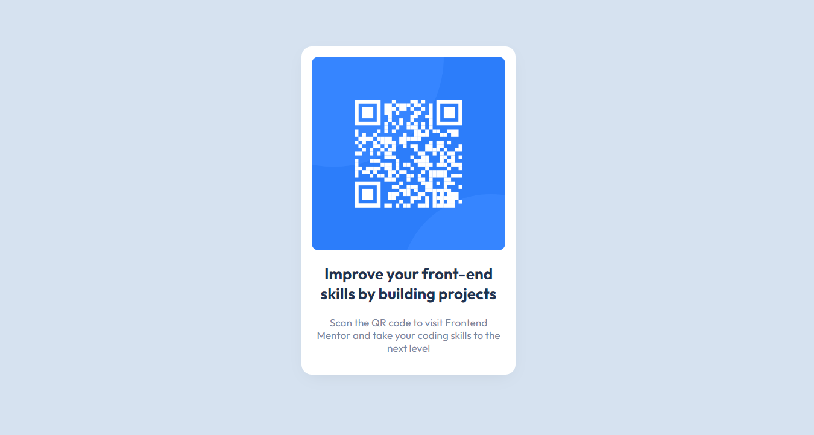

# Frontend Mentor - QR code component solution

This is a solution to the [QR code component challenge on Frontend Mentor](https://www.frontendmentor.io/challenges/qr-code-component-iux_sIO_H). Frontend Mentor challenges help you improve your coding skills by building realistic projects.

## Table of contents

- [Overview](#overview)
  - [Screenshot](#screenshot)
  - [Links](#links)
- [My process](#my-process)
  - [Built with](#built-with)
- [Author](#author)

## Overview

### Screenshot

### Links

- Solution URL: [solution](https://your-solution-url.com)
- Live Site URL: [live site](https://qr-code-component-frontendmentor-challenge.netlify.app/)

## My process

### Built with

- Semantic HTML5 markup
- CSS custom properties

## Author

- github - [dangelomedinag](https://www.your-site.com)
- Frontend Mentor - [@yourusername](https://www.frontendmentor.io/profile/dangelomedinag)
- Twitter - [@yourusername](https://www.twitter.com/dangelomedinag)
